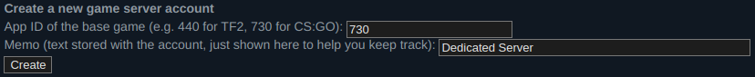

# terraform-aws-counter-strike-go

Terraform code for Counter Strike dedicated server on AWS

## HOW TO USE?

1. Create a Game Server Login Token.\
Open https://steamcommunity.com/dev/managegameservers in your browser and login with your steam account.\
Create a new Login Token with the APP ID of `730` (Counter String GO Game) and add a Memo so you can remember
where you are using this game token.



Save the token, you'll need it later to setup the instance.

2. Create an user on AWS and configure these environment variables accordingly:
```
AWS_SECRET_ACCESS_KEY
AWS_ACCESS_KEY_ID
```

3. `terraform init`
4. `terraform plan --var-file=custom_vars.tfvars`
4. Configure the token in [custom_vars.tfvars](./custo_vars.tfvars) file, `token` key.
5. `terraform apply --var-file=custom_vars.tfvars`
   1. If you want to pass or change any other variable in `vars.tf` use `--var "KEY=VALUE"`. See [vars.tf](./vars.tf) for the `KEY`. This will overrwide the `KEY` in [custom_vars.tfvars](./custo_vars.tfvars) file.

## How To SSH Into The Server?
Terraform will create the `id_rsa` and `id_rsa.pub` ssh keys to be used to access the instance.

The instance will be created with a public IP assocciated and will output it in the end. To access the instance
you should execute `ssh ubuntu@PUBLIC_IP -i id_rsa` changing *PUBLIC_IP* accordingly from the output.\

if you lost the output from terraform you can run `terraform output` and you'll find all information you need.

## How To Connect To The Server From CSGO?
Open your terminal and type `connect PUBLIC_IP` changing *PUBLIC_IP* accordingly.

## Change Game Mode
**Reference**: https://docs.linuxgsm.com/game-servers/counter-strike-global-offensive
| Game Modes | Game Type | Game Mode | Map Group |
|------------|:---------:|:---------:|:---------:|
| Arms Race  | 1 | 0 | mg_armsrace|
| Classic Casual | 0 | 0 | mg_casualsigma, mg_casualdelta |
| Classic Competitive | 0 | 1 | mg_active, mg_reserves, mg_hostage, mg_de_dust2 |
| Custom | 3 | 0 ||
| Deathmatch | 1 | 2 | mg_deathmatch |
| Demolition | 1 | 1 | mg_demolition |
| Wingman | 0 | 2 ||
| Danger Zone | 6 | 0 | mg_dz_blacksite (map: dz_blacksite), mg_dz_sirocco (map: dz_irocco)|

if you want to change the game type you can change them accordingly in [custom_vars.tfvars](./custom_vars.tfvars)

## INPUT
| Variable | Description | Default | Mandatory |
|:-:|:-:|:-:|:-:|
| token | Steam Token | - | yes |
| region | AWS Region | `"eu-west-2"` | yes |
| security_group_name | Security Group Name Prefix | `"main"` | yes |
| instance_type | AWS Instance Type | `"m5.large"` | yes |
| password | CSGO Server Password (RCON and Private) | - | no |
| tags | CSGO Server Tags For Information | - | no |
| logging | CSGO Server Logging | `"off"` | no |
| game_type | CSGO Game Type | `0` | yes |
| game_mode | CSGO Server Game Mode | `1` | yes |
| map_group | CSGO Server Map Group | `"mg_active, mg_reserves, mg_hostage, mg_de_dust2"` | yes |
| default_map | CSGO Server Initial Map | `"de_mirage"` | yes |
| max_players | CSGO Server Max Players | `"10"` | yes |

## OUTPUT
| Variable | Description |
|:-:|:-:|
| instance_public_ip | AWS Instance Public IP for RCON And Game Connection |
| password | CSGO Server Password (RCON and Private) |
| public_ssh_key | AWS Instance Public SSH Key |
| random_pet_name | CSGO Server Hostname Random String |


## Recommendations
To connect to the remote console use this cli [rcon-cli](https://github.com/itzg/rcon-cli).

## TODO
- Implement Telegram or Discord notifications, see [Alerts](https://docs.linuxgsm.com/alerts)
- Remove Bots from the server on startup
- Any other ideas are welcome
